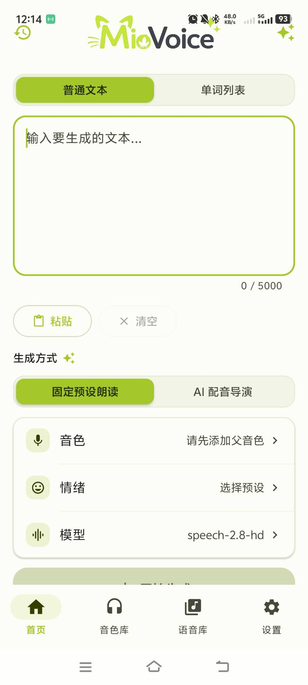
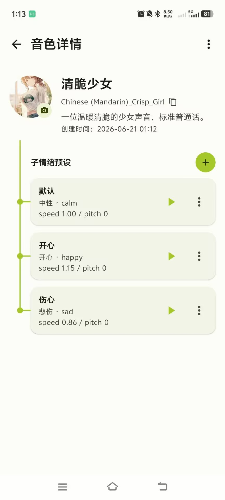
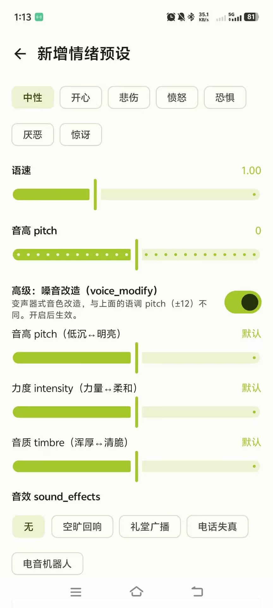
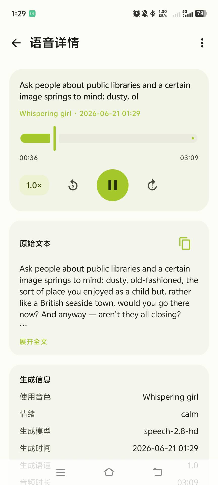

<div align="center">


# Mio Voice

一个 Android TTS 客户端，围绕音色调节、语音生成、AI 辅助分析与音频资源管理，让语音生成成为一个可以长期使用和管理的完整流程。

[下载 APK](../../releases) · [功能介绍](#主要功能) · [开发计划](#开发计划) · [参与贡献](#参与贡献)

</div>

---

> [!WARNING]
> Mio Voice 目前处于 Alpha 开发阶段。
>
> 核心语音生成流程已经可以使用，但部分功能、界面和异常处理仍在持续完善中。使用前请自行保管好 API Key，并注意第三方服务可能产生的费用。

## 项目简介

Mio Voice 是一个面向 Android 平台的文本转语音应用。

很多 TTS 服务虽然提供了完整的 API，但在实际使用时，用户往往需要反复填写模型、音色、情绪和其他生成参数。

Mio Voice 希望将这些配置整理为更加直观的音色库和情绪预设，让语音生成不再只是一次性的 API 调用，而是一个可以长期使用和管理的完整应用。

项目目前主要围绕 MiniMax TTS 进行开发，同时也在为后续接入更多云端 TTS 服务预留扩展能力。

### 它能用来做什么

Mio Voice 最初源于我自己的一个需求：用喜欢的音色，把英文文章和轻小说读出来，当作日常可以反复收听的素材。

所以它的重点不是“调一次 API、生成一段音频就结束”，而是把生成的语音当作可以**反复收听、长期积累和整理**的内容来管理。

把想听的文字粘贴进来，选好音色和情绪，生成之后还能按「组」归类、随时回听。一些可能的使用场景：

- 📚 **语言学习**：把英语、日语等外语的文章或轻小说粘贴进来，让喜欢的音色逐段读出来当作听力素材；也可以用「单词列表」逐个朗读单词、辅助记忆。（具体支持哪些语言取决于所使用的 TTS 服务。）
- 🎧 **听书与通勤**：把想读的小说、网文、长文章转成语音，在通勤、做家务、走路时用耳朵“读完”。
- 📰 **资讯与长文**：把收藏的长文、推送、笔记读出来，解放眼睛，碎片时间也能消化内容。
- 🎙️ **配音与创作草稿**：借助多音色和情绪预设，为视频旁白、短剧、有声内容快速生成配音草稿。
- 😴 **睡前与放松**：用偏好的音色读一些轻松内容，当作入睡前的背景音。
- 👀 **护眼与无障碍**：在眼睛疲劳或不方便长时间阅读时，用“听”代替“看”。
- 📝 **文稿校对**：听一遍自己写的文章或讲稿，比逐字看更容易发现拗口和疏漏。
- 🗂️ **素材归档**：把不同来源、不同主题的语音按「组」分类收藏，长期积累成自己的“有声内容库”。

它在设计时参考了英语听力等学习场景，但并不局限于此——任何“想把文字变成可以长期收听的语音”的需求，都可以用它来生成和整理。

> 这是我个人利用业余时间、借助 AI 辅助编程（vibe coding）完成的项目。我并非专业的 Android 开发者，代码结构和工程实践可能存在不够规范、不够优雅，甚至需要重构的地方。如果你在使用或阅读源码时发现问题，欢迎通过 Issue 或 Pull Request 指出——这也是项目选择开源的原因之一。项目会在迭代中逐步改进功能与代码质量。

## 界面预览

<div align="center">

<table>
  <tr>
    <td align="center"><br>首页</td>
    <td align="center"><br>音色库</td>
    <td align="center"><br>语音库</td>
  </tr>
  <tr>
    <td align="center"><br>音色详情</td>
    <td align="center"><br>情绪预设</td>
    <td align="center"><br>语音详情</td>
  </tr>
</table>

</div>

> 界面视觉效果仍有提升空间，这是后续版本的重点改进方向之一。
>
> 此外，上述情绪与参数调节目前仅适配 MiniMax TTS；其他 TTS 服务因参数体系不同，将在未来逐步适配。

## 主要功能

### 文本转语音

- 选择音色与情绪预设，将文本生成为语音
- 长文本自动分段生成
- 实时显示生成进度与错误信息
- 即时播放生成结果

### 音色库

- 添加、编辑和管理 TTS 音色
- 采用“父音色 → 子情绪预设”的两层结构，一个基础音色下可挂多个表达风格
- 记录音色名称、Voice ID 与简介

### 情绪预设

在同一个音色下创建多个情绪或表达预设，内置常用情绪可直接选用：

- 中性、开心、悲伤、生气、害怕、惊讶
- 自定义表达风格

每个预设可单独保存情绪、语速、音量、音调等生成参数。

### 生成记录

- 按时间查看历史生成内容，含完整原始文本、音色与模型信息
- 回放历史音频
- 查看长文本分段生成后的各段音频

### 独立服务配置

TTS 语音服务与 AI 文本分析服务的配置相互独立、分页管理，避免地址、模型和密钥混在一起。

### AI 文本分析

可选配兼容 OpenAI 接口的 AI 服务，辅助长文本分段与语音表达。该功能与 TTS 相互独立，未配置时不影响基础的文本转语音。

> AI 文本分析目前仍为实验性功能，实际效果取决于所配置的模型与服务。

## 当前支持情况

| 服务 | 文本转语音 | 音色管理 | 情绪预设 | 当前状态 |
|---|---:|---:|---:|---|
| MiniMax | ✅ | ✅ | ✅ | 已支持 |
| 其他云端 TTS | ❌ | ❌ | ❌ | 规划中 |
| IndexTTS2 | ❌ | ❌ | ❌ | 期望支持 |
| GPT-SoVITS | ❌ | ❌ | ❌ | 期望支持 |
| 其他本地 TTS 服务 | ❌ | ❌ | ❌ | 长期规划 |

> 当前版本主要围绕 MiniMax TTS 进行适配。
>
> IndexTTS2、GPT-SoVITS 等本地模型，以及其他可本地部署的 TTS 服务，是我比较希望接入的方向，但受限于个人精力，短期内难以排期。它们会作为长期规划保留在计划中逐步推进，具体能否实现及时间安排仍取决于后续的接口情况与实际条件，暂时无法做出承诺。

## 下载安装

前往项目的 [Releases](../../releases) 页面下载最新版本 APK。

当前测试版本：

```text
Mio Voice v0.1.0 Alpha
```

下载对应的 APK 文件后，即可在 Android 设备上安装。

你也可以同时下载 `.sha256` 文件，用于验证 APK 文件是否完整。校验示例：

```bash
# Linux / macOS
sha256sum -c Mio-Voice-v0.1.0-alpha.apk.sha256

# Windows (PowerShell)
Get-FileHash Mio-Voice-v0.1.0-alpha.apk -Algorithm SHA256
```

### 系统要求

- Android 最低版本：Android 8.0（API 26）
- 推荐 Android 版本：Android 13 及以上（应用以 API 35 / Android 15 为目标平台编译）
- 需要网络连接
- 需要用户自行准备受支持 TTS 服务的 API 地址和密钥

由于当前版本仍处于早期测试阶段，不建议将其用于关键或生产用途。

## 数据与隐私

Mio Voice 本身不提供语音模型或 AI 模型服务。

生成语音时，用户输入的文本会被发送至自行配置的第三方 TTS 服务。启用 AI 文本分析时，相关文本也可能被发送至用户配置的 AI 服务。

请注意：

- 项目仓库不包含任何真实 API Key
- 用户需要自行申请和保管第三方服务密钥
- 请勿将 API Key 分享给其他人
- 文本和音频的处理方式取决于对应第三方服务
- 使用前请阅读对应服务的隐私政策和使用条款
- 第三方 API 产生的费用由用户自行承担

关于 API Key 的本地存储：

> 应用使用 Android Keystore 生成的密钥对 API Key 进行 AES-GCM 加密，仅将加密后的密文保存在用户本地设备上（基于 DataStore）。密钥本身由系统 Keystore 管理，不会随明文一同存储，也不会上传到任何服务器。

## 从源码构建

### 开发环境

项目主要使用以下技术：

- Kotlin
- Jetpack Compose
- Room
- DataStore
- Media3 (ExoPlayer)
- OkHttp
- Kotlin Coroutines
- Android Gradle Plugin
- Gradle Wrapper

推荐开发环境：

- Android Studio：Ladybug（2024.2.1）或更高版本（需支持 AGP 8.7）
- JDK：JDK 17
- Android SDK：compileSdk 35（Android SDK Platform 35 + Build-Tools 35 及以上）
- Kotlin：2.0.21（以项目 Gradle 配置为准）
- Gradle：8.9（由 Gradle Wrapper 提供，无需单独安装）

### 克隆项目

```bash
git clone https://github.com/miofling/mio-voice.git
cd mio-voice
```

### 构建 Debug APK

Windows：

```bash
gradlew.bat assembleDebug
```

macOS / Linux：

```bash
./gradlew assembleDebug
```

构建完成后，APK 通常位于：

```text
app/build/outputs/apk/debug/
```

也可以直接通过 Android Studio 构建：

```text
Build → Build App Bundle(s) / APK(s) → Build APK(s)
```

## Release 签名

为了保护开发者的签名信息，项目仓库不会包含：

- 正式 Keystore 文件
- Keystore 密码
- Key Alias
- Key Password
- 真实 API Key
- 本地环境配置

开发者可以自行创建 Keystore，并在本地配置 Release 签名。构建脚本会在项目根目录读取 `keystore.properties`，需要包含以下字段：

```properties
storeFile=相对项目根目录的 keystore 路径
storePassword=你的 keystore 密码
keyAlias=你的 key alias
keyPassword=你的 key 密码
```

> 若 `keystore.properties` 缺失，`assembleRelease` 会输出未签名 APK 并在日志中给出提示；若文件存在但字段不完整，构建会失败并提示缺少的字段。

请勿将以下内容提交到 Git：

```text
keystore.properties
*.jks
*.keystore
local.properties
```

默认情况下，开发者可以正常构建 Debug 版本。构建正式 Release APK 时，需要自行准备签名文件和相关配置。

## 项目结构

```text
app/src/main/java/com/mio/voice/
├── cache/         # 音频缓存
├── core/          # 核心逻辑（文本分段、生成指纹等）
├── data/          # 数据模型、本地存储与音色库
│   └── generation/    # 生成记录的数据库、DAO 与仓库
├── director/      # AI 文本分析（OpenAI 兼容）相关逻辑
├── export/        # 音频导出
├── playback/      # 音频播放控制
├── provider/      # TTS 服务适配（MiniMax 等）
├── ui/            # Compose 页面、组件与 ViewModel
└── MainActivity.kt
```

> 项目结构可能会随着后续开发继续调整。

## 开发计划

### 已完成

- [x] 基础文本转语音流程
- [x] MiniMax TTS 服务配置
- [x] 音色库
- [x] 父音色与子情绪预设
- [x] 长文本分段生成
- [x] 历史生成记录
- [x] 语音详情页面
- [x] 基础音频播放
- [x] TTS 与 AI 配置页面分离
- [x] Alpha APK 发布

### 正在完善

- [ ] 优化生成过程中的状态展示
- [ ] 完善错误提示与异常处理
- [ ] 优化音色库交互
- [ ] 完善音频保存与导出
- [ ] 优化不同尺寸设备的界面适配
- [ ] 打磨界面视觉细节
- [ ] 完善 AI 文本与情绪分析
- [ ] 增加更多自动化测试

### 未来计划

- [ ] 抽象统一的 TTS Provider 接口
- [ ] 接入更多云端 TTS 服务
- [ ] 接入 IndexTTS2、GPT-SoVITS 等本地部署的 TTS 模型
- [ ] 支持导入文本文件，并辅助分析与分段
- [ ] 增加音频分享功能
- [ ] 增加配置导入与导出
- [ ] 完善应用界面的国际化（多语言）
- [ ] 完善开发者文档

> 以上路线图会根据实际开发情况调整——当然，前提是这个项目没有不幸沉入海底。😶‍🌫️

## 已知问题

当前 Alpha 版本可能存在以下问题：

- 部分错误提示不够清晰
- 不同 Android 系统上的界面表现可能存在差异
- 长文本生成速度取决于第三方服务
- 第三方服务接口变化可能导致相关功能暂时失效
- 部分页面和返回逻辑仍在持续优化
- Release 构建流程尚未经过大范围设备测试

发现问题时，欢迎通过 Issue 反馈。

## 参与贡献

欢迎提交 Issue、功能建议和 Pull Request。

目前比较需要帮助的方向包括：

- 新的云端 TTS Provider 适配
- Android 界面与交互优化
- 多设备兼容性测试
- 错误处理
- 音频播放、保存与导出
- 文档完善
- 英文及其他语言翻译

对于较大的功能修改，建议先创建 Issue 说明方案，避免重复开发或与项目方向产生冲突。

## 提交问题

提交 Bug 时，建议提供：

- Mio Voice 版本
- Android 版本
- 手机型号
- 使用的 TTS 服务
- 问题复现步骤
- 错误截图
- 已隐藏敏感信息的相关日志

请勿在 Issue 中提交：

- API Key
- 完整鉴权请求
- Keystore 文件或密码
- 其他个人隐私和敏感信息

## 开源协议

本项目采用 [MIT License](./LICENSE) 开源协议。

## 致谢

感谢以下项目和技术：

- Kotlin
- Jetpack Compose
- Android Jetpack（Room、DataStore、Lifecycle 等）
- Media3 (ExoPlayer)
- OkHttp
- Kotlin Coroutines

同时感谢所有参与测试、提出建议和提交反馈的用户。

## 免责声明

Mio Voice 只是一个个人开发的第三方开源客户端，和 MiniMax 及其他 TTS、AI 服务商没有任何官方关系。

它本身不提供语音或 AI 能力，只是帮你调用自己配置的服务。相关账号、费用和使用风险都需要你自己承担。

另外也拜托一下：请不要用它生成违法、侵权、欺诈或冒充他人的内容。使用时请遵守当地的法律法规，以及所用第三方服务的条款。

---

<div align="center">

Made with Kotlin and Jetpack Compose.

</div>
